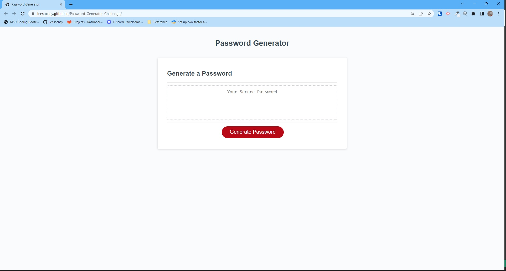
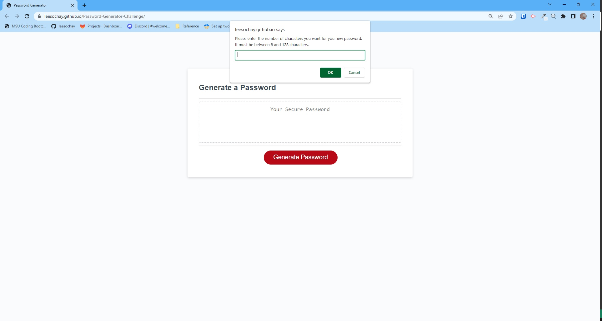
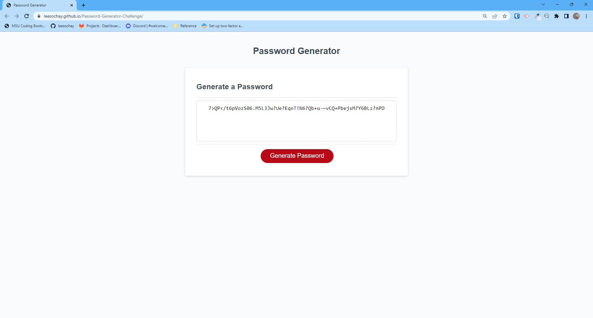

# Password-Generator-Challenge

## Description

This challenge is a challenge to work with JavaScript to create an application that will generate a random password based on the criteria selected. The focus for this challenge is to power the password generator using JavaScript. Many methods were employed during this challenge including variable declaration, arrays and array methods, functions, prompts and confirm pop up boxes, if-else statements, and for loops.

The password can be from 8 to 128 characters and can include any combination of lowercase letters, uppercase letters, special characters and numbers.

Acceptance Criteria icludes:

Clicking the "Generate Password" button starts a series of prompts for the password criteria.
The prompts include the length of the password (0-128 characters).
The criteria of lowercase letters, uppercase letters, special characters and numbers are selected to be included or not.
When the prompts are answered, with at least one character type, the password is written to the page.

## Usage

By clicking the "Generate Password" button, a series of prompts will walk the user to generating a password of a chosen length and selected character types. Please see the following screenshots as an example.

The finished project page can be viewed at [leesochay.github.io/Password-Generator-Challenge](https://leesochay.github.io/Password-Generator-Challenge/).

## License

MIT License
